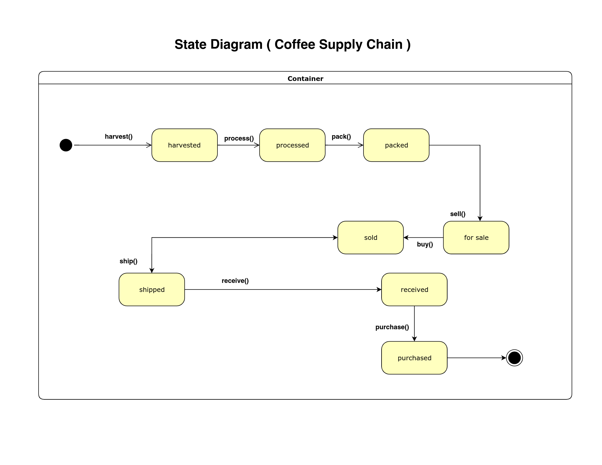
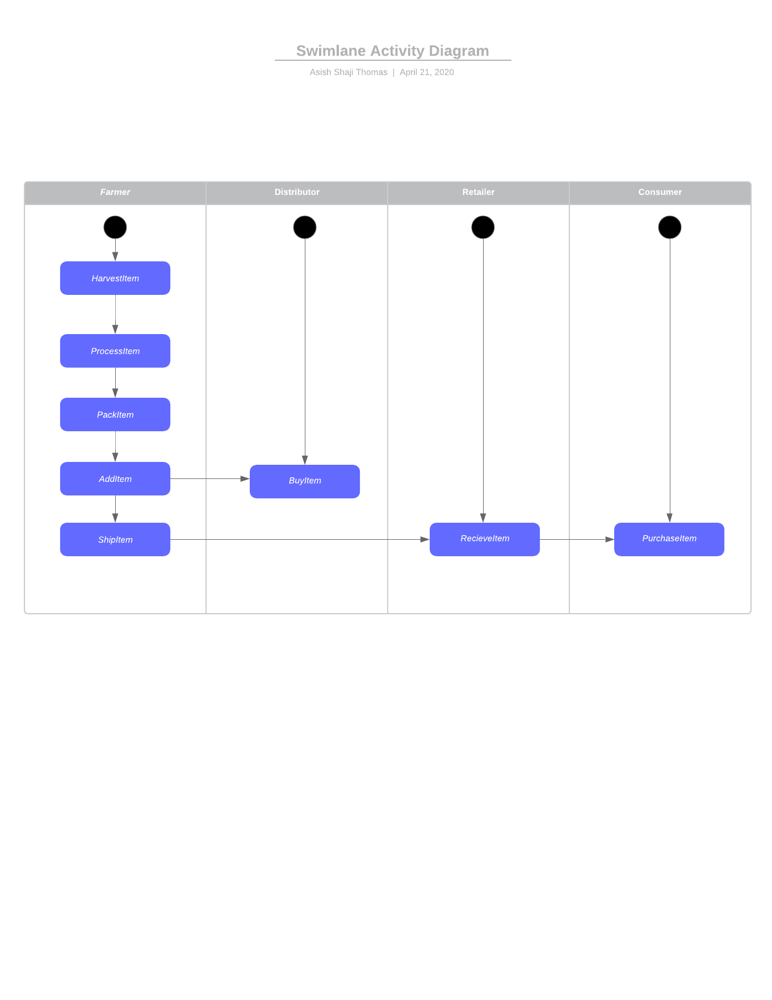
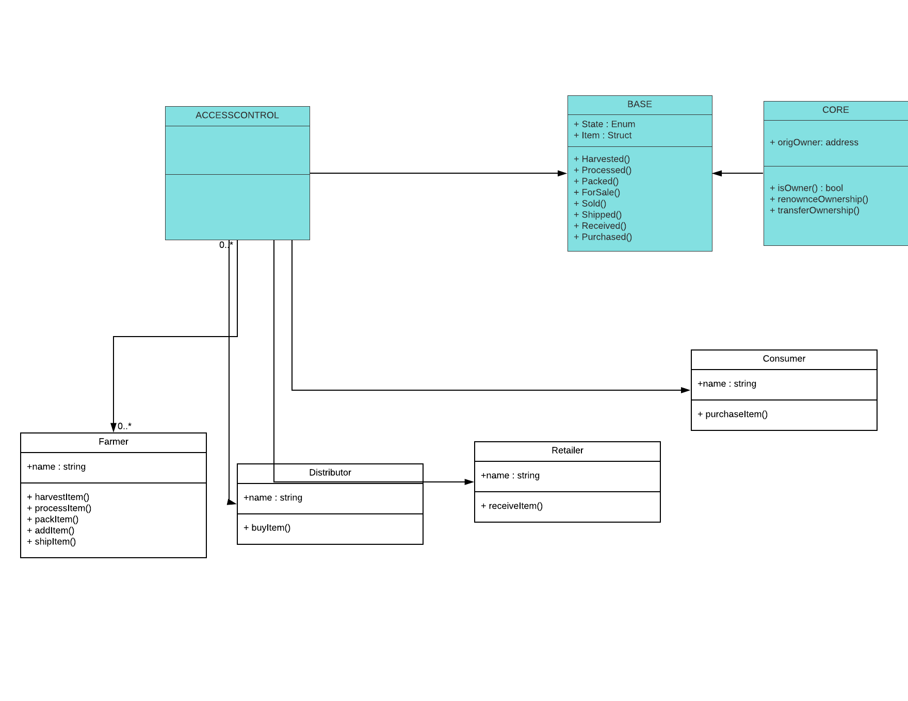
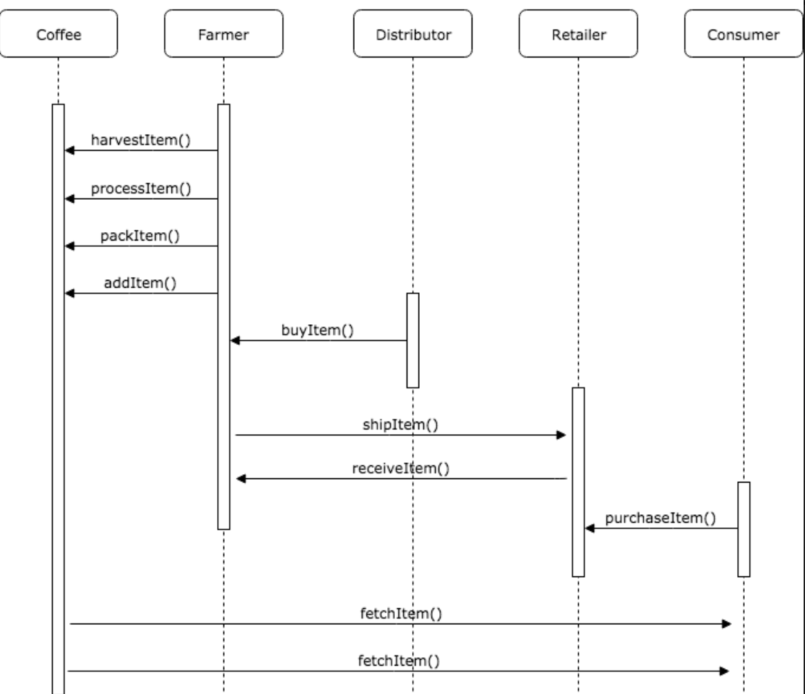

# Project Writeup

* State Diagram

   

* Activity Diagram 
   

* Data Model Diagram
   

* Sequence Diagram 
   

`truffle develop` is run 
`compile` command compiles the contract
`test` runs the tests
`truffle migrate --reset --network rinkeby` is run to deploy the contracts into rinkeby test network. 

1_initial_migration.js
======================

   Deploying 'Migrations'
   ----------------------
   > block number:        6352417
   > block timestamp:     1587441676
   > account:             0x2994D23dBA017ed722DE6aE927b7f606D2022c53
   > balance:             2.97044639
   > gas used:            223594
   > gas price:           10 gwei
   > value sent:          0 ETH
   > total cost:          0.00223594 ETH

   -------------------------------------
   > Total cost:          0.00223594 ETH

2_deploy_contracts.js
=====================

   Deploying 'FarmerRole'
   ----------------------
   > block number:        6352419
   > block timestamp:     1587441706
   > account:             0x2994D23dBA017ed722DE6aE927b7f606D2022c53
   > balance:             2.9671847
   > gas used:            298821
   > gas price:           10 gwei
   > value sent:          0 ETH
   > total cost:          0.00298821 ETH

   Deploying 'DistributorRole'
   ---------------------------
   > block number:        6352420
   > block timestamp:     1587441730
   > account:             0x2994D23dBA017ed722DE6aE927b7f606D2022c53
   > balance:             2.96425544
   > gas used:            292926
   > gas price:           10 gwei
   > value sent:          0 ETH
   > total cost:          0.00292926 ETH

   Deploying 'RetailerRole'
   ------------------------
   > block number:        6352421
   > block timestamp:     1587441753
   > account:             0x2994D23dBA017ed722DE6aE927b7f606D2022c53
   > balance:             2.96132606
   > gas used:            292938
   > gas price:           10 gwei
   > value sent:          0 ETH
   > total cost:          0.00292938 ETH

   Deploying 'ConsumerRole'
   ------------------------
   > block number:        6352422
   > block timestamp:     1587441775
   > account:             0x2994D23dBA017ed722DE6aE927b7f606D2022c53
   > balance:             2.9583968
   > gas used:            292926
   > gas price:           10 gwei
   > value sent:          0 ETH
   > total cost:          0.00292926 ETH

   Deploying 'SupplyChain'
   -----------------------
   > block number:        6352423
   > block timestamp:     1587441843
   > account:             0x2994D23dBA017ed722DE6aE927b7f606D2022c53
   > balance:             2.93303924
   > gas used:            2535756
   > gas price:           10 gwei
   > value sent:          0 ETH
   > total cost:          0.02535756 ETH

   -------------------------------------
   > Total cost:          0.03713367 ETH

Summary
=======
> Total deployments:   6
> Final cost:          0.03936961 ETH

Starting migrations...
======================
> Network name:    'rinkeby'
> Network id:      4
> Block gas limit: 0x989680

1_initial_migration.js
======================

   Deploying 'Migrations'
   ----------------------
   > transaction hash:    0x4a18620a2beba91fc188bb455a173209c74d8e90464cf4bf8640516afcb77554
   > Blocks: 2            Seconds: 19
   > contract address:    0x18ac97880cc258a1e9D5e330692C519557e16BE5
   > block number:        6352433
   > block timestamp:     1587441906
   > account:             0x2994D23dBA017ed722DE6aE927b7f606D2022c53
   > balance:             2.97029639
   > gas used:            238594
   > gas price:           10 gwei
   > value sent:          0 ETH
   > total cost:          0.00238594 ETH

   > Saving migration to chain.
   > Saving artifacts
   -------------------------------------
   > Total cost:          0.00238594 ETH

2_deploy_contracts.js
=====================

   Deploying 'FarmerRole'
   ----------------------
   > transaction hash:    0xff22342083a60db176a85a3a6b8fdf5c9233be552d45e98467a87fffcc143007
   > Blocks: 0            Seconds: 6
   > contract address:    0xAE1acb305CF1f1147fAeC13F7758e0b4058c40ac
   > block number:        6352435
   > block timestamp:     1587441936
   > account:             0x2994D23dBA017ed722DE6aE927b7f606D2022c53
   > balance:             2.9667347
   > gas used:            313821
   > gas price:           10 gwei
   > value sent:          0 ETH
   > total cost:          0.00313821 ETH

   Deploying 'DistributorRole'
   ---------------------------
   > transaction hash:    0x724e8cd79c786f41979f09b8dfe313d197c7ef8fd9ba39e464e3d378896ef8fa
   > Blocks: 1            Seconds: 18
   > contract address:    0x6e22f757b755f29EfdE469e5CC83436c56546A8C
   > block number:        6352437
   > block timestamp:     1587441966
   > account:             0x2994D23dBA017ed722DE6aE927b7f606D2022c53
   > balance:             2.96365544
   > gas used:            307926
   > gas price:           10 gwei
   > value sent:          0 ETH
   > total cost:          0.00307926 ETH

   Deploying 'RetailerRole'
   ------------------------
   > transaction hash:    0x19aa3fcdce82ada3f38b29478d7bdd206376127e289ea3853e78e77086381a3c
   > Blocks: 1            Seconds: 18
   > contract address:    0x7d4A9Deb46BC343eAE0F1935cC56183d105a3CC9
   > block number:        6352439
   > block timestamp:     1587441996
   > account:             0x2994D23dBA017ed722DE6aE927b7f606D2022c53
   > balance:             2.96057606
   > gas used:            307938
   > gas price:           10 gwei
   > value sent:          0 ETH
   > total cost:          0.00307938 ETH

   Deploying 'ConsumerRole'
   ------------------------
   > transaction hash:    0xa2d3be28ba41724ea4ba18c749ed67841539097e0981c3052e2c787dcc634a60
   > Blocks: 1            Seconds: 18
   > contract address:    0x1d5cB112514Fd770cBD044846fb5f2B6313a20d2
   > block number:        6352441
   > block timestamp:     1587442026
   > account:             0x2994D23dBA017ed722DE6aE927b7f606D2022c53
   > balance:             2.9574968
   > gas used:            307926
   > gas price:           10 gwei
   > value sent:          0 ETH
   > total cost:          0.00307926 ETH

   Deploying 'SupplyChain'
   -----------------------
   > transaction hash:    0xabb98dd59a58c3cc683003eb2553b1e6f43f86802cbf22d0168a2e32f904aa97
   > Blocks: 1            Seconds: 18
   > contract address:    0x957BB112C038caE479300e0c48BAd56957283b75
   > block number:        6352443
   > block timestamp:     1587442056
   > account:             0x2994D23dBA017ed722DE6aE927b7f606D2022c53
   > balance:             2.93108924
   > gas used:            2640756
   > gas price:           10 gwei
   > value sent:          0 ETH
   > total cost:          0.02640756 ETH

   > Saving migration to chain.
   > Saving artifacts
   -------------------------------------
   > Total cost:          0.03878367 ETH

Summary
=======
> Total deployments:   6
> Final cost:          0.04116961 ETH

Truffle v5.1.14-nodeLTS.0 (core: 5.1.13)
Solidity - ^0.4.23 (solc-js)
Node v12.16.2
Web3.js v1.2.1